# Overview

Overview articles give background information and provide context to a particular subject.
Their goal is to explain a concept, not to teach or give instructions.

# Overview

```mermaid
%%{init: {"theme": "dark", "flowchart": {"curve": "basis"}}}%%

flowchart TB
    style preproc stroke-width:4px,stroke-dasharray: 5 5,fill:#1e90ff,stroke:#1e90ff,color:#fff,opacity:1,fill-opacity:0.8,stroke-opacity:0.8,stroke-linecap:round,stroke-dashoffset:0  
    style thirdparty stroke-width:4px,stroke-dasharray: 5 5,fill:#1e90ff,stroke:#1e90ff,color:#fff
    style community minWidth:100%,stroke-width:4px,stroke-dasharray: 5 5,fill:#1e90ff,stroke:#1e90ff,color:#fff
    style postproc stroke-width:4px,stroke-dasharray: 5 5,fill:#1e90ff,stroke:#1e90ff,color:#fff
    style core stroke-width:4px,stroke-dasharray: 5 5,fill:#1e90ff,stroke:#1e90ff,color:#fff
    style agents stroke-width:4px,stroke-dasharray: 5 5,fill:#1e90ff,stroke:#1e90ff,color:#fff


    style omni-tool stroke-width:4px,stroke-dasharray:
    style users-group stroke-width:4px,stroke-dasharray: 1 12,fill:#1e90ff,stroke:#000,color:#fff,opacity:1,fill-opacity:0.8,stroke-opacity:0.8,stroke-linecap:round,stroke-dashoffset:0  
    style users-group-users stroke-width:4px,stroke-dasharray: 5 5,fill:#1e90ff,stroke:#1e90ff,color:#fff
    style users-group-users-user fill:#000,stroke:#fff,stroke-width:2px;


    style users-group-users-hotkeys fill:#000,stroke:#fff,stroke-width:2px;
    style users-group-users-triggers fill:#000,stroke:#fff,stroke-width:2px;


    style passive-inputs stroke-width:4px,stroke-dasharray: 5 5,fill:#1e90ff,stroke:#1e90ff,color:#fff,opacity:1,fill-opacity:0.8,stroke-opacity:0.8,stroke-linecap:round,stroke-dashoffset:0  
    style passive-inputs-camera fill:#000,stroke:#fff,stroke-width:2px;
    style passive-inputs-audio fill:#000,stroke:#fff,stroke-width:2px;

    style active-inputs stroke-width:4px,stroke-dasharray: 5 5,fill:#1e90ff,stroke:#1e90ff,color:#fff,opacity:1,fill-opacity:0.8,stroke-opacity:0.8,stroke-linecap:round,stroke-dashoffset:0 
    style active-inputs-text fill:#000,stroke:#fff,stroke-width:2px;
    style active-inputs-screenshot fill:#000,stroke:#fff,stroke-width:2px;
    style active-inputs-files fill:#000,stroke:#fff,stroke-width:2px;
    style active-inputs-projects fill:#000,stroke:#fff,stroke-width:2px;
    style active-inputs-voice fill:#000,stroke:#fff,stroke-width:2px;
    style active-inputs-sign fill:#000,stroke:#fff,stroke-width:2px;

    
    style pias minWidth:1000,stroke-width:4px,stroke-dasharray: 5 5,fill:#1e90ff,stroke:#1e90ff,color:#fff,opacity:1,fill-opacity:0.8,stroke-opacity:0.8,stroke-linecap:round,stroke-dashoffset:0
    style pias min-width:1000
    
    subgraph omni-tool [Omni Tool]
         
        subgraph users-group [ ]
            direction TB
            subgraph users-group-users [ ]
                direction TB
                users-group-users-user([fa:fa-font User])
                users-group-users-hotkeys([fa:fa-font Hotkeys])
                users-group-users-triggers([fa:fa-font Triggers])

            end
            
            subgraph pias [a personal interactive Avatar a]
                pias-pia(fa:fa-font Ghost)
            end
            
            subgraph passive-inputs [Passive Inputs]
                direction TB
                passive-inputs-camera([fa:fa-font Camera]) 
                passive-inputs-audio([fa:fa-image Audio])
            end
            
            subgraph active-inputs [Active Inputs]
                direction TB
                active-inputs-text([fa:fa-font Text]) 
                active-inputs-screenshot([fa:fa-image Screenshots])
                active-inputs-files([fa:fa-file Files]) 
                active-inputs-projects([fa:fa-project-diagram Projects]) 
                active-inputs-voice([fa:fa-microphone Voice])
                active-inputs-sign([fa:fa-microphone Sign])
            end
            
                
    
            users-group-users-user --> users-group-users-triggers
            users-group-users-user --> users-group-users-hotkeys

            passive-inputs --> pias
            active-inputs --> pias
            users-group-users --> active-inputs

        end
        
        

    
        subgraph preproc [Prepocessing]
            preprocessing 
        end
    
    
        subgraph thirdparty [Third Party Applications]
            direction
        end
    
    
        subgraph postproc [PostProcessing]
            direction
        end
    
        subgraph community [Community]
            direction
        end
    
    
        subgraph core [Core]
            direction
        end
        
        subgraph agents [Agents]
            direction
        end
    end


```

## What is product/service/concept

Provide some background and context, explain choices and alternatives.

## Glossary

A definition list or a glossary:

First Term
: This is the definition of the first term.

Second Term
: This is the definition of the second term.
